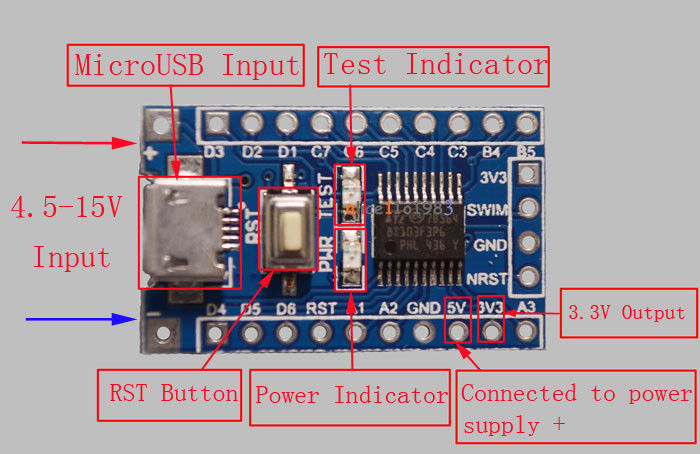
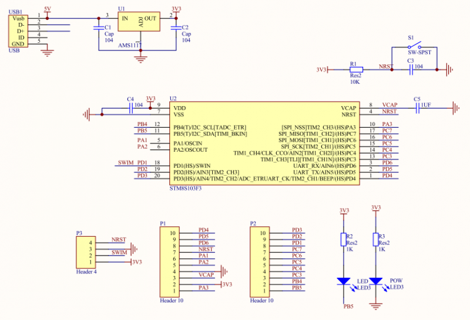
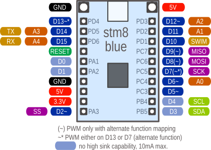

# Generic STM8S103 breakout board

These simple breakout boards are available on aliexpress for well under one
Dollar (I got mine for 67 cent each, including shipping from China). They
are my original development platform.

They are very similar the [ESP14 Wifi-boards](hardware/esp14.html), most
programs should run on those chinese gems as well, but that is still
untested.

The STM8S103 breakout boards are build around a CPU STM8S103F3P6 with 16MHz
internal oscillator, 8kB flash, 1kB RAM, and 640 byte EEPROM. The CPU
includes a UART, SPI, I2C, PWM, 10 bit ADC, 3 timer, and up to 14 I/O pins -
quite similar to an Atmel ATmega8.

One (red) LED is connected to GPIO PB5 (CPU pin 11). The push button is for
reset. The CPU runs on 3.3V, a linear regulator is integrated on the
board. The micro USB connector is only for (5V) power supply, the data lines
are not connected.

All CPU pins are easily accessible on (optional) pin headers (pitch 2.54mm,
perfect for breadboards).

My breakout boards came preprogrammed with a blink program and with active
write protection bits. For unlocking before first use:

	stm8flash -cstlinkv2 -pstm8s103?3 -u

## Connection to the flash tool

I am using the ST-Link V2 compatible flash tool in the green plastic
housing. The one in the metal housing uses a different pinout.

Connection to the flashtool:

Signal name	|P3 on CPU board	|Green flash tool|Metal flash tool
------ 		|-----:			|-----: 	|-----:
3V3    		|1      		|2      	| 7
SWIM   		|2      		|5      	| 5
GND    		|3      		|7      	| 3
NRST   		|4      		|9      	| 1

## Pin number mappings

The Arduino environment uses its own pin numbering scheme independent from
the physical CPU pin numbers. Many Arduino sketches and libraries contain
hard-coded assumptions about the number of pins with special functions.
Ideally, all these numbers would be the same and all programs could be
compiled without changes.

[Here](pin_mapping.html) I discuss some possible pin mapping and check
how close we could get the the ideal mapping. Unfortunatly, it turns out
that a perfect mapping is not possible.

In the end I chose a simple geometric numbering for the square UFQFPN20
package starting with port pin PA1 and counting up from 0. This results in
this mapping:

The pins D3/D4 (SDA/SCL, PB5/PB4) are different from the others as they are
true open drain pins. That means, they only can drive the output low or
open. To drive it high, they require the of an external pull-up resistor.
This is the reason why the LED on this breakout is connected between +3.3V
and the pins and not between the pin GND as usual. This way it is possible
to drive the LED by writing a zero to the output register.

sduino pin	| STM8S103 CPU port pin
----------	| ---------------------
 0-2		| PA1-PA3 (PA1 and PA2 only weak output drivers)
 3-4		| PB5-PB4 (reverse order)
 5-9		| PC3-PC7
10-15		| PD1-PD6

serial: 14,15  
SPI: 2,7,8,9  
I2C: 3,4 (true open drain. can't drive a high signal without an external
pull-up resistor)
Analog: 6,11,12,14,15  
PWM: 2,5,6,12 plus either only 13 or 7-9 but not 13 (via alternate mapping)  

 + Easy and logical for use on a breadboard
 + Very clear and logical port pin ordering
 - Analog pins are still scattered around
 + TX and RX would be the rarely used analog pin numbers A3/A4 at
   the end of the analog pin number list
 + At least the analog pins are in data sheet order
 - All functions use totally different pin numbers than Arduino

I am still not really happy with this mapping. Instead of simplifing things
it only adds another layer of abstraction and confusion. To avoid this I
added definitions for the regular CPU pin names like `PA1` and `PD2`. In the
end, this notation seems to be a lot easier to me. I am open for suggestions
for a better pin number mapping.

The chosen pin mapping for the STM8S103 (possible alternate function in
paratheses):

|Phys. STM8 pin|Name	|Functions	|Geometrical mapping|special funcion
|---:	|---	|---			| ---	|---
|1	|PD4	|UART_CLK/T2-1/beep	|13	|PWM
|2	|PD5	|TX/Ain5		|14	|Analog A3
|3	|PD6	|RX/Ain6		|15	|Analog A4
|5	|PA1	|(OscIn, kein HS)	|0	|
|6	|PA2	|(OscIn, kein HS)	|1	|
|10	|PA3	|SS/T2-3		|2	|PWM
|11	|PB5	|SDA	LED		|3	|
|12	|PB4	|SCL			|4	|
|13	|PC3	|T1-3/[T1-n1]		|5	|PWM, (n~)
|14	|PC4	|T1-4/Ain2/[T1-n2]	|6	|PWM, Analog A0, (n~)
|15	|PC5	|SCK/[T2-1]		|7	|(~)
|16	|PC6	|MOSI/[T1-1]		|8	|(~)
|17	|PC7	|MISO/[T1-2]		|9	|(~)
|18	|PD1	|(SWIM)			|10	|
|19	|PD2	|Ain3/[T2-3]		|11	|Analog A1, (~~)
|20	|PD3	|Ain4/T2-2		|12	|PWM, Analog A2

