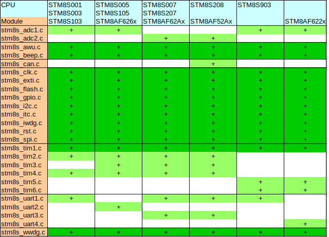

# Compiling the ST Standard Peripheral Library SPL


all of this might be moved to this location at a later stage of the project:
hardware/tools/stm8/STM8S_StdPeriph_Driver


## Supported CPUs

The script in `tools/showdeps.sh` lists the known CPU names defined in
inc/stm8s.h. Some CPUs use identical libraries:

Product line				| supported CPU types per library
----------------------------------	| ---------------------------
| Low density devices			| STM8S001, STM8S003, STM8S103
| Medium density devices		| STM8S005, STM8S105, STM8AF626x
| High density devices without CAN	| STM8S007, STM8S207, STM8AF62Ax
| High density devices with CAN		| STM8S208, STM8AF52Ax
| App. specific low density devices	| STM8S903
|					| STM8AF622x


Supported peripherie for the different CPUs:

CPU	|STM8S001|STM8S005 |STM8S007	|STM8S208  |STM8S903	|
	|STM8S003|STM8S105 |STM8S207	|	   |		|
Module	|STM8S103|STM8AF626x|STM8AF62Ax	|STM8AF52Ax|		|STM8AF622x
------	|:-----:|:------:  |:------:	|:------:  |:------:	|
stm8s_adc1.c|+	|+	   |		|	   |+		|+
stm8s_adc2.c|	|	   |+		|+	   |		|
stm8s_awu.c|+	|+	   |+		|+	   |+		|+
stm8s_beep.c|+	|+	   |+		|+	   |+		|+
stm8s_can.c|	|	   |		|+	   |		|
stm8s_clk.c|+	|+	   |+		|+	   |+		|+
stm8s_exti.c|+	|+	   |+		|+	   |+		|+
stm8s_flash.c|+	|+	   |+		|+	   |+		|+
stm8s_gpio.c|+	|+	|+		|+	   |+		|+
stm8s_i2c.c|+	|+	|+		|+	   |+		|+
stm8s_itc.c|+	|+	|+		|+	   |+		|+
stm8s_iwdg.c|+	|+	|+		|+	   |+		|+
stm8s_rst.c|+	|+	|+		|+	   |+		|+
stm8s_spi.c|+	|+	|+		|+	   |+		|+
stm8s_tim1.c|+	|+	|+		|+	   |+		|+
stm8s_tim2.c|+	|+	|+		|+	   |		|
stm8s_tim3.c|	|+	|+		|+	   |		|
stm8s_tim4.c|+	|+	|+		|+	|		|
stm8s_tim5.c|	|	|		|	|+		|+
stm8s_tim6.c|	|	|		|	|+		|+
stm8s_uart1.c|+	|	|+		|+	|+		|
stm8s_uart2.c|	|+	|		|	|		|
stm8s_uart3.c|	|	|+		|+	|		|
stm8s_uart4.c|	|	|		|	|		|+
stm8s_wwdg.c|+	|+	|+		|+	|+		|+




## STM8S903 and STM8AF622x

The definitions for these two (uncommon) CPUs are flawed in the original
versions of the SPL. `inc/stm8s.h` needs
[this patch](correct_stm8s908.patch) if you start from
scratch with the stock SPL files from the ST website.


## Recycle bin

Some (maybe) useful leftovers. These code snipplets might be useful again
later.


### Compare the contents of two libraries

Unpack two libraries and compare the individual files: `cmplib.sh`

```bash
#!/bin/sh

rm -rf a b
mkdir a b
(cd a; ar x ../$1)
(cd b; ar x ../$2)
diff -r a b
```

### Determine the CPU dependencies within a Makefile

```make
DEPS=$(shell sdcc -mstm8 -Iinc -Isrc -D$(CPU) "-Wp-MM" -E inc/stm8s.h)
HFILES = $(subst inc/,,$(filter inc/stm8s_%.h,$(DEPS)))

$(info DEPS=$(DEPS))
$(info HFILES=$(HFILES))
```
(now use HFILES to generate list of C-files into LIBSOURCES)

If all source files are already split into single-function source files
this could be used to compile only the modules needed for the current CPU:

```make
# include all parts for every needed module in the LIBSOURCES list
find_files = $(wildcard $(module)-*)
SOURCES := $(foreach module,$(LIBSOURCES),$(find_files))
# if only the needed modules got split: This simple version is good enough
#SOURCES := $(wildcard stm8s*.c)

OBJECTS=$(SOURCES:.c=.o)
OBJECTS_LINK=$(SOURCES:.c=.rel)
EXECUTABLE=$(shell echo $(CPU)|tr '[:upper:]' '[:lower:]').lib

# test output
$(info LIBSCOMMON: $(LIBSCOMMON))
$(info LIBSOURCES: $(LIBSOURCES))
#$(info SOURCES: $(SOURCES))
$(info EXECUTABLE: $(EXECUTABLE))


# targets
nothing:

all: $(SOURCES) $(EXECUTABLE)
	echo $^

$(EXECUTABLE): $(OBJECTS)
	$(AR) $(LDFLAGS) $(EXECUTABLE) $(OBJECTS_LINK) 

.c.o:
	$(CC) $(CFLAGS) $< -o $@

clean: 
	rm -f *.lib *.rst *.rel *.lst *.ihx *.sym *.asm *.lk *.map
	rm -f $(EXECUTABLE)
```

